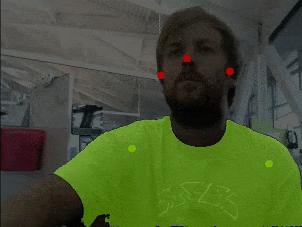
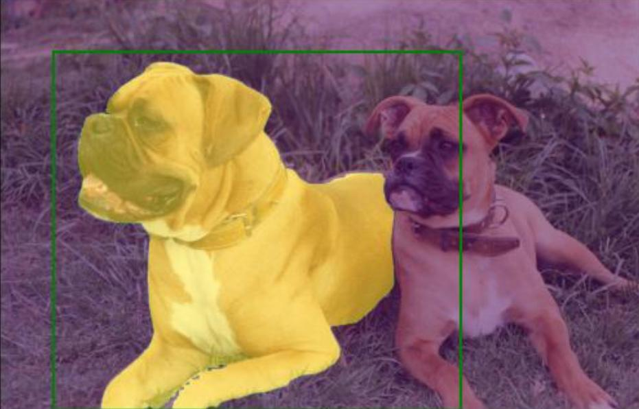
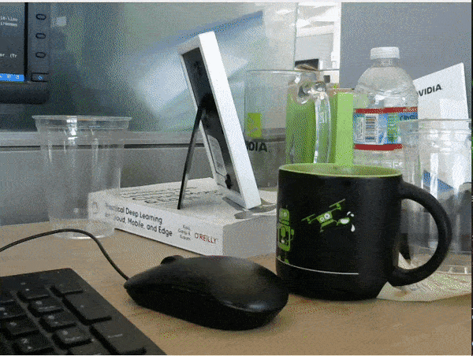
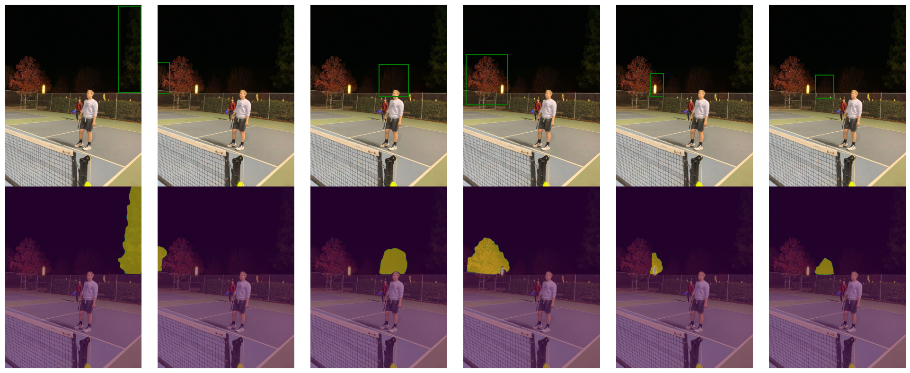
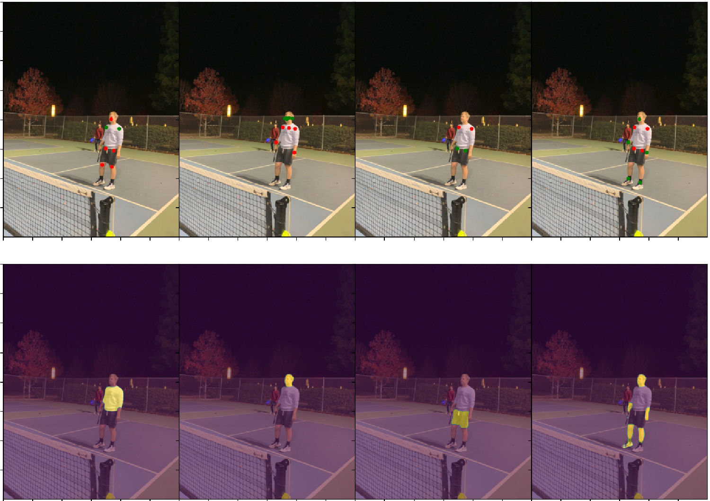

# NanoSAM

NanoSAM is a [Segment Anything (SAM)](https://github.com/facebookresearch/segment-anything) model variant that is capable of running in real-time on NVIDIA Jetson platforms with NVIDIA TensorRT.  

   


## Usage

Using NanoSAM from Python looks like this.

```python3
from nanosam.utils.predictor import Predictor

predictor = Predictor(
    image_encoder="data/resnet18_image_encoder.engine",
    mask_decoder="data/mobile_sam_mask_decoder.engine"
)

image = PIL.Image.open("dog.jpg")

predictor.set_image(image)

mask, _, _ = predictor.predict(np.array([[x, y]]), np.array([1]))
```

<details>
<summary>Notes</summary>
The point labels may be

| Point Label | Description |
|:--------------------:|-------------|
| 0 | Background point |
| 1 | Foreground point |
| 2 | Bounding box top-left |
| 3 | Bounding box bottom-right |
</details>

> Follow the instructions below for how to build the engine files.

## Performance

NanoSAM runs real-time on Jetson Orin Nano.

<table style="border-top: solid 1px; border-left: solid 1px; border-right: solid 1px; border-bottom: solid 1px">
    <thead>
        <tr>
            <th rowspan=2 style="text-align: center; border-right: solid 1px">Model †</th>
            <th colspan=2 style="text-align: center; border-right: solid 1px">Jetson Orin Nano (ms)</th>
            <th colspan=2 style="text-align: center; border-right: solid 1px">Jetson AGX Orin (ms)</th>
            <th colspan=4 style="text-align: center; border-right: solid 1px">Accuracy (mIoU) ‡</th>
        </tr>
        <tr>
            <th style="text-align: center; border-right: solid 1px">Image Encoder</th>
            <th style="text-align: center; border-right: solid 1px">Full Pipeline</th>
            <th style="text-align: center; border-right: solid 1px">Image Encoder</th>
            <th style="text-align: center; border-right: solid 1px">Full Pipeline</th>
            <th style="text-align: center; border-right: solid 1px">All</th>
            <th style="text-align: center; border-right: solid 1px">Small</th>
            <th style="text-align: center; border-right: solid 1px">Medium</th>
            <th style="text-align: center; border-right: solid 1px">Large</th>
        </tr>
    </thead>
    <tbody>
        <tr>
            <td style="text-align: center; border-right: solid 1px">MobileSAM</td>
            <td style="text-align: center; border-right: solid 1px">TBD</td>
            <td style="text-align: center; border-right: solid 1px">146</td>
            <td style="text-align: center; border-right: solid 1px">35</td>
            <td style="text-align: center; border-right: solid 1px">39</td>
            <td style="text-align: center; border-right: solid 1px">0.728</td>
            <td style="text-align: center; border-right: solid 1px">0.658</td>
            <td style="text-align: center; border-right: solid 1px">0.759</td>
            <td style="text-align: center; border-right: solid 1px">0.804</td>
        </tr>
        <tr>
            <td style="text-align: center; border-right: solid 1px">NanoSAM (ResNet18)</td>
            <td style="text-align: center; border-right: solid 1px">TBD</td>
            <td style="text-align: center; border-right: solid 1px">27</td>
            <td style="text-align: center; border-right: solid 1px">4.2</td>
            <td style="text-align: center; border-right: solid 1px">8.1</td>
            <td style="text-align: center; border-right: solid 1px">0.706</td>
            <td style="text-align: center; border-right: solid 1px">0.624</td>
            <td style="text-align: center; border-right: solid 1px">0.738</td>
            <td style="text-align: center; border-right: solid 1px">0.796</td>
        </tr>
    </tbody>
</table>

<details>
<summary>Notes</summary>

† The MobileSAM image encoder is optimized with FP32 precision because it produced erroneous results when built for FP16 precision with TensorRT.  The NanoSAM image encoder
is built with FP16 precision as we did not notice a significant accuracy degredation.  Both pipelines use the same mask decoder which is built with FP32 precision.  For all models, the accuracy reported uses the same model configuration used to measure latency.

‡ Accuracy is computed by prompting SAM with ground-truth object bounding box annotations from the COCO 2017 validation dataset.  The IoU is then computed between the mask output of the SAM model for the object and the ground-truth COCO segmentation mask for the object.  The mIoU is the average IoU over all objects in the COCO 2017 validation set matching the target object size (small, medium, large).  

</details>

## Getting Started

1. Install the dependencies

    1. Install PyTorch

    2. Install [torch2trt](https://github.com/NVIDIA-AI-IOT/torch2trt)
    3. Install NVIDIA TensorRT
    4. (optional) Install [TRTPose](https://github.com/NVIDIA-AI-IOT/trt_pose) - For the pose example.
        
        ```bash
        git clone https://github.com/NVIDIA-AI-IOT/trt_pose
        cd trt_pose
        python3 setup.py develop --user
        ```

    5. (optional) Install the Transformers library - For the OWL ViT example.

        ```bash
        python3 -m pip install transformers
        ```

2. Install the NanoSAM Python package
    
    ```bash
    git clone https://github.com/NVIDIA-AI-IOT/nanosam
    cd nanosam
    python3 setup.py develop --user
    ```

3. Build the TensorRT engine for the mask decoder

    1. Download the mask decoder: [mobile_sam_mask_decoder.onnx](https://drive.google.com/file/d/1jYNvnseTL49SNRx9PDcbkZ9DwsY8up7n/view?usp=drive_link) 

    2. Build the TensorRT engine

        ```bash
        trtexec \
            --onnx=data/mobile_sam_mask_decoder.onnx \
            --saveEngine=data/mobile_sam_mask_decoder.engine \
            --minShapes=point_coords:1x1x2,point_labels:1x1 \
            --optShapes=point_coords:1x1x2,point_labels:1x1 \
            --maxShapes=point_coords:1x10x2,point_labels:1x10
        ```

        > This assumes the mask decoder ONNX file is downloaded to ``data/mobile_sam_mask_decoder.onnx``

4. Build the TensorRT engine for the NanoSAM image encoder

    1. Download the image encoder: [resnet18_image_encoder.onnx](https://drive.google.com/file/d/14-SsvoaTl-esC3JOzomHDnI9OGgdO2OR/view?usp=drive_link)
    
    2. Build the TensorRT engine

        ```bash
        trtexec \
            --onnx=data/resnet18_image_encoder.onnx \
            --saveEngine=data/resnet18_image_encoder.engine \
            --fp16
        ```

5. Run the basic usage example

    ```
    python3 examples/basic_usage.py \
        --image_encoder=data/resnet18_image_encoder.engine \
        --mask_decoder=data/mobile_sam_mask_decoder.engine
    ```

    > This outputs a result to ``data/basic_usage_out.jpg``


That's it!  From there, you can read the example code for examples on how
to use NanoSAM with Python.  Or try running the more advanced examples below.

## Examples

### Example 1 - Basic usage


This example uses a known image with a fixed bounding box to control NanoSAM
segmentation.  

To run the example, call

```python3
python3 examples/basic_usage.py \
    --image_encoder="data/resnet18_image_encoder.engine" \
    --mask_decoder="data/mobile_sam_mask_decoder.engine"
```

### Example 2 - Segment with OWL-ViT



This example demonstrates using OWL-ViT to detect objects using a text prompt(s),
and then segmenting these objects using NanoSAM.

To run the example, call

```bash
python3 examples/segment_from_owl.py \
    --prompt="A tree" \
    --image_encoder="data/resnet18_image_encoder.engine" \
    --mask_decoder="data/mobile_sam_mask_decoder.engine
```

<details>
<summary>Notes</summary>
- While OWL-ViT does not run real-time on Jetson Orin Nano (3sec/img), it is nice for experimentation
as it allows you to detect a wide variety of objects.  You could substitute any
other real-time pre-trained object detector to take full advantage of NanoSAM's 
speed.
</details>

### Example 3 - Segment with TRTPose (offline)



This example demonstrates how to use human pose keypoints from [TRTPose](https://github.com/NVIDIA-AI-IOT/trt_pose) to control NanoSAM segmentation.

To run the example, call

```bash
python3 examples/segment_from_pose.py
```

This will save an output figure to ``data/segment_from_pose_out.png``.

We provide a live camera demo to segment your T-Shirt using pose.

### Example 4 - Segment with TRTPose (online)


This example demonstrates how to use human pose to control segmentation on
a live camera feed.  This example requires an attached display and camera.

To run the example, call

```python3
python3 examples/demo_pose_tshirt.py
```

### Example 5 - Segment and track (experimental)


This example demonstrates a rudimentary segmentation tracking with NanoSAM.
This example requires an attached display and camera.

To run the example, call

```python3
python3 examples/demo_click_segment_track.py <image_encoder_engine> <mask_decoder_engine>
```

Once the example is running **double click** an object you want to track.

<details>
<summary>Notes</summary>
This tracking method is very simple and can get lost easily.  It is intended to
demonstrate creative ways you can use NanoSAM, but would likely be improved with
more work.
</details>

## Training

You can train NanoSAM on a single GPU

1. Download and extract the COCO 2017 train images

    ```bash
    # mkdir -p data/coco  # uncomment if it doesn't exist
    mkdir -p data/coco
    cd data/coco
    wget http://images.cocodataset.org/zips/train2017.zip
    unzip train2017.zip
    cd ../..
    ```

2. Build the MobileSAM image encoder (used as teacher model)

    1. Export to ONNX

        ```bash
        python3 -m nanosam.tools.export_sam_image_encoder_onnx \
            --checkpoint="assets/mobile_sam.pt" \
            --output="data/mobile_sam_image_encoder_bs16.onnx" \
            --model_type=vit_t \
            --batch_size=16
        ```

    2. Build the TensorRT engine with batch size 16

        ```bash
        trtexec \
            --onnx=data/mobile_sam_image_encoder_bs16.onnx \
            --shapes=image:16x3x1024x1024 \
            --saveEngine=data/mobile_sam_image_encoder_bs16.engine
        ```

3. Train the NanoSAM image encoder by distilling MobileSAM

    ```bash
    python3 -m nanosam.tools.train \
        --images=data/coco/train2017 \
        --output_dir=data/models/resnet18 \
        --model_name=resnet18 \
        --teacher_image_encoder_engine=data/mobile_sam_image_encoder_bs16.engine \
        --batch_size=16
    ```

    <details>
    <summary>Notes</summary>
    Once training, visualizations of progress and checkpoints will be saved to
    the specified output directory.  You can stop training and resume from the last
    saved checkpoint if needed.

    For a list of arguments, you can type 

    ```bash
    python3 -m nanosam.tools.train --help
    ```
    </details>

4. Export the trained NanoSAM image encoder to ONNX

    ```bash
    python3 -m nanosam.tools.export_image_encoder_onnx \
        --model_name=resnet18 \
        --checkpoint="data/models/resnet18/checkpoint.pth" \
        --output="data/resnet18_image_encoder.onnx"
    ```

You can then build the TensorRT engine as detailed in the getting started section.

## Evaluation

You can reproduce the accuracy results above by evaluating against COCO ground
truth masks


1. Download and extract the COCO 2017 validation set.

    ```bash
    # mkdir -p data/coco  # uncomment if it doesn't exist
    cd data/coco
    wget http://images.cocodataset.org/zips/val2017.zip
    wget http://images.cocodataset.org/annotations/annotations_trainval2017.zip
    unzip val2017.zip
    unzip annotations_trainval2017.zip
    cd ../..
    ```

2. Compute the IoU of NanoSAM mask predictions against the ground truth COCO mask annotation.

    ```bash
    python3 -m nanosam.tools.eval_coco \
        --coco_root=data/coco/val2017 \
        --coco_ann=data/coco/annotations/instances_val2017.json \
        --image_encoder=data/resnet18_image_encoder.engine \
        --mask_decoder=data/mobile_sam_mask_decoder.engine \
        --output=data/resnet18_coco_results.json
    ```

    > This uses the COCO ground-truth bounding boxes as inputs to NanoSAM

3. Compute the average IoU over a selected category or size

    ```bash
    python3 -m nanosam.tools.compute_eval_coco_metrics \
        data/efficientvit_b0_coco_results.json \
        --size="all"
    ```

    <details>
    <summary>Notes</summary>
    For all options type ``python3 -m nanosam.tools.compute_eval_coco_metrics --help``.

    To compute the mIoU for a specific category id.

    ```bash
    python3 -m nanosam.tools.compute_eval_coco_metrics \
        data/resnet18_coco_results.json \
        --category_id=1
    ```
    </details>


## Acknowledgement

This work is enabled by the great projects below.

- [SAM](https://github.com/facebookresearch/segment-anything) - The original Segment Anything model.
- [MobileSAM](https://github.com/ChaoningZhang/MobileSAM) - The distilled Tiny ViT Segment Anything model.